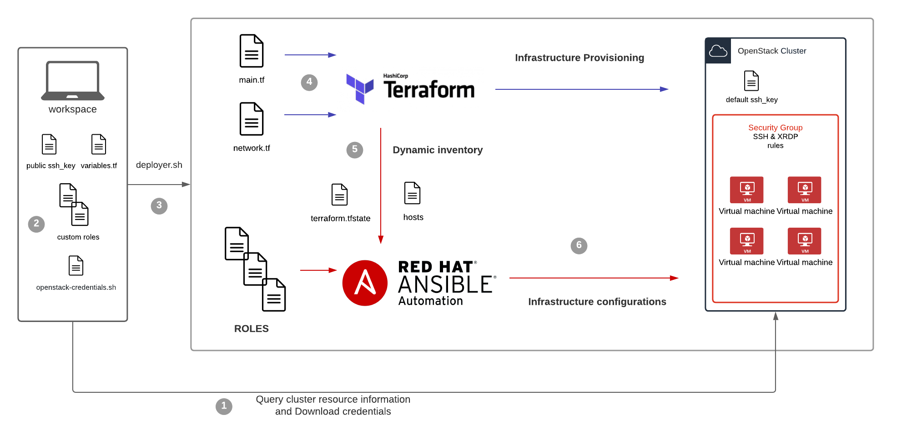

# OpenStack VM Setup Automation

## Introduction

The goal of this repo is to automate the deployment and configuration of VM base environment on an OpenStack cluster.

 The deployer operates two main tasks:
  - Infrastructure provisioning: Creates virtual machines, security groups, floating IPs, and uploading ssh-key. \
 Implementation tool - Terraform.

  - Infrastructure configuration: for each VM, we run a set of pre-configured settings listed in the sections below.\
 Implementation tool - Ansible.

The configuration in this repo is for the [ROSE](https://github.com/RedHat-Israel/ROSE) on [MOC](https://massopen.cloud/) project and can easily be adjusted if needed.

This repo can be used to deploy later updates after the initial environment is set up.
<br>

## Deployment Components



### OpenStack Infrastructure Provisioning using Terraform
- Deploy public ssh key as default for all VM
- Single Security Group include two rules: ssh and XRDP
- Create X instances of virtual machines
- Assigns floating IPs (public IP address) to all vms

**VM Details**
- Instance Name : VMXX
- Source image: centos-7-x86_64
- Flavor size: m1.s2.large

** those names need to match your OpenStack cluster's configuration, you can check images and flavors in the Openstack UI or use the OpenStack cli tool 
([guide how to get resources information](https://github.com/ipolonsk/openstack-vms-automation/blob/master/docs/get_resources_names.md))

### VM Configuration using Ansible
Our configuration set of settings includes the following:
- Install Graphical Tool and use it as default while booting
- Install and configure XRDP service and firewall roles to allow GUI access for the student from a windows pc
- Install development tools such as: python3,pip,git,tmux,GCC,pytest,pipenv,chrome and more
- Create two users: admin(sudo user) and a student
- Copy given public ssh-keys to user admin(for mentors access)
- Clone the ROSE project to the student's home directory
- Updates all packages and reboot to apply new changes

Those settings can be modified by editing the roles in the Ansible directory.

### Workflow in general 
1. Query information about your Openstack cluster (info like images name and more) and download credentials file to be able to login into your cluster 
2. Customize the deployment:\
   a. Add path to your public ssh-key\
   b. Edit variables values use the queried info you collected\
   c. Place the credentials file in the main folder\
   d. Customize the VM configuration by editing and adding roles to Ansible
 3. Run the deployer.sh
 4. Terraform loads configuration files and compare to current status, and provisioning the infrastructure
 5. Terraform created a `hosts` file with IPs of the VMs to be used by Ansible, create a status file to describe the deployment
 6. Ansible reads playbook configuration and configure the VMs
 
<br>

## Usage

### Pre-requirements & customization

- Ansible and Terraform installed -
   ```
   $ ansible --version
   ansible 2.9.16
   $ terraform --version
   Terraform v0.14.4
   ```
   
- Edit `terraform/variables.tf`-

   Change ALL values to match your OpenStack environment,\
   You can query the values via OpenStack UI dashboard or the cli.([guide how to get resources information](https://github.com/ipolonsk/openstack-vms-automation/blob/master/docs/get_resources_names.md))
 
- Download your credentials from the OpenStack API interface and copy it to our main folder under the name "openstack-credentials.sh". 
([guide how to download the credentials file](https://github.com/ipolonsk/openstack-vms-automation/blob/master/docs/get_credentials_file.md))

   Main folder content -
   ```
   .
   ├── ansible
   ├── deploy.sh
   ├── docs
   ├── openstack-credentials.sh
   ├── README.md
   └── terraform
   ```

- Edit `ansible/group_vars/authorized_keys.yml` - \
to include the ssh-keys you want to be deployed to the user 'admin'.

- Custumize the ansible configutaion be editing or adding roles as you want under `ansible/roles`
and include them in the `ansible/deployment.yml` playbook.

### Running the deployer

Make sure you have the right quota for your user before running the deployer.

All is left to do is to run the deployer:
```
$ ./deployer.sh
```
Estimating time: 40~ min

After that, you should see the X number of VMs created and ready to use in your OpenStack.

<br>

## Troubleshooting:
### Errors:
-  Authentication error - 
   ```
   Error: One of 'auth_url' or 'cloud' must be specified
   on providers.tf line 1, in provider "openstack":
      1: provider "openstack" {}
   ```
   the file you download is invalid and can't be used to used the OpenStack API.
   debug the credentcals file:
   ```
   $ source ./openstack-credentials.sh.
   $ openstack image list
   ```
   You should see information about your cluster.

   If not, please check your credentials file. ([guide how to download the credentials file](https://github.com/ipolonsk/openstack-vms-automation/blob/master/docs/get_credentials_file.md))
<br>

### Delete the deployment:
```
$ cd terraform
$ source ../openstack-credentials.sh
$ terraform destroy
```
<br>

## Day 2 operations:

### Steps to deploy updates/changed to existing VMS environment for inital setup:
- Create a new folder for the role under ansible/roles/
- Create a new file tasks/main.yml under that folder with the modules.
- Add the name of the folder to this updates.yml under 'roles'
- Make sure your public key is added to the VM for the user admin
- run: `ansible-playbook updates.yml`
