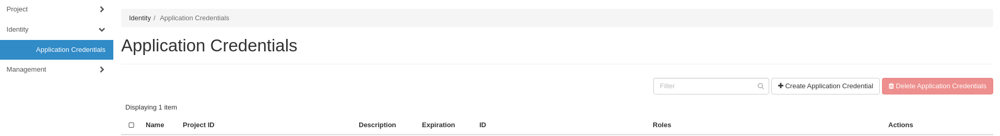

## Get Credentials to run the deployer

To run the deployer, you will need to import into the folder your credentials from the OpenStack.
This guide is for the MOC users, but the process is similar to other OpenStack clusters.

### Steps:
1. Access and login: `https://onboarding.massopen.cloud/` \
(My personal authenticate is "Institution Account")
2. Go to: Identity -> Application Credentials -> Create Application Credential


3. Enter a new credentials application name
4. Click on 'Create Application Credential'
5. Now choose the option 'Download openrc file'
6. Copy the file into the main folder under the name 'openstack-credentials.sh'

File example: 
```
$ cat openstack-credentials.sh
#!/usr/bin/env bash

export OS_AUTH_TYPE=v3applicationcredential
export OS_AUTH_URL=https://full_cluster_domain_name:13000/v3
export OS_IDENTITY_API_VERSION=3
export OS_REGION_NAME="region_name"
export OS_INTERFACE=public
export OS_APPLICATION_CREDENTIAL_ID=<id>
export OS_APPLICATION_CREDENTIAL_SECRET=<hash_secret>
```
