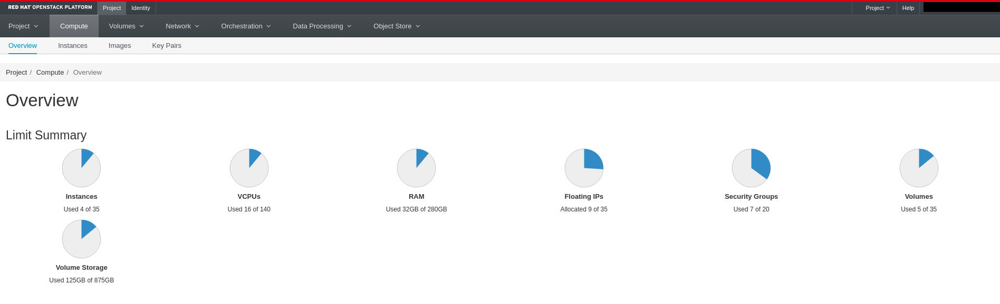
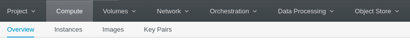

## How to get OpenStack resources names and quota


### OpenStack UI dashboard

#### Quate
Login into your OpenStack cluster:
On the main page, you will see your quote details: 



#### Resources names 

From the main dashboard, access every resource from the tabs:



for example:
1. Go to Images 
2. You will see a list of available to use images
3. Choose an image and copy its name to `terraform/variables.tf` file in the value.

This way, you will need to find the names of your image, flavor, flouting pool, and network. 

flouting pool & network
- 'Network' tab -> Networks

flavor: 
Compute-> flavor

(if you don't have this option, you can try to "launch Instance" from the 'Instances' tabs, you will see 'Flavor' section on the main with the list of flavors)

### Openstack cli

1. First, you need to import the Credentials file into the main folder.
2. source the file to have the variable export to the current shell:
```
$ source OpenStack-credentials.sh
```
3. Use OpenStack CLI to query the needed information:
for each command, a list with optional values will be print, for each resource, choose the wanted value and copy it to `terraform/variables.tf` file.

```
$ OpenStack image list
$ OpenStack flavor list
```
For floating_pool & network_name values"
```
$ OpenStack network list
```

For quota query:
```
$ OpenStack quota show
```
